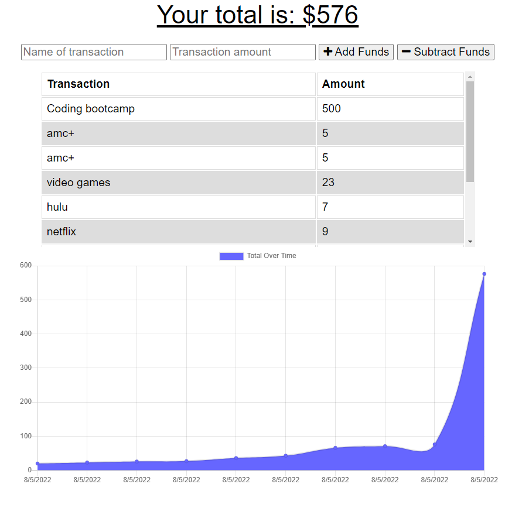

# PWA budget tracker
  	




## Table of Contents
- [Description](#description)
- [User Story](#user-story)
- [Acceptance Criteria](#acceptance-criteria)
- [Installation](#installation)
- [Contributing](#contributing)

## Description
This tracker allows users to budget there expenses without connection to the internet. This mobile first web applications allows people to budget their money from anywhere, and immediately upload their budget to the database when the connection is re-established

    Link: 

## User Story 
```
AS AN avid traveler
I WANT to be able to track my withdrawals and deposits with or without a data/internet connection
SO THAT my account balance is accurate when I am traveling 
```
## Acceptance Criteria
```
GIVEN a budget tracker without an internet connection
WHEN the user inputs an expense or deposit
THEN they will receive a notification that they have added an expense or deposit
WHEN the user reestablishes an internet connection
THEN the deposits or expenses added while they were offline are added to their transaction history and their totals are updated
```

## Installation
`npm i` 


## Contributing

Made by Chris Manfredi